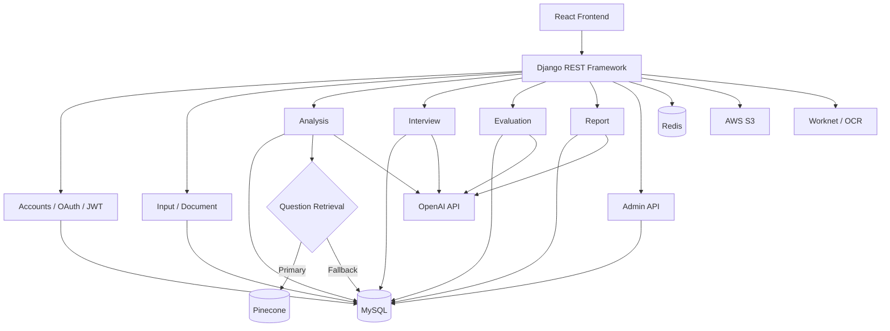
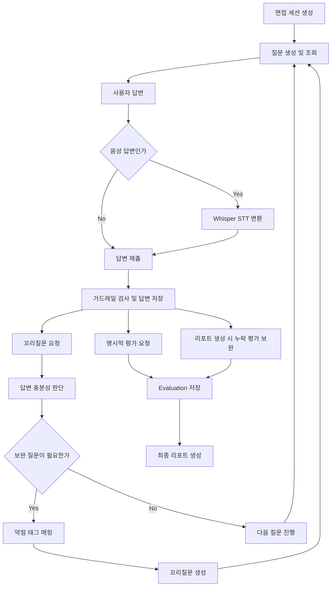
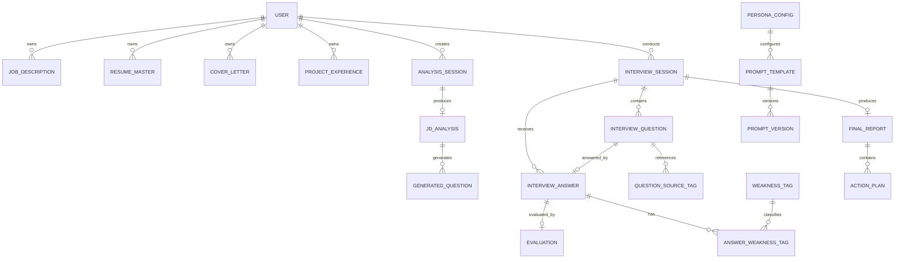
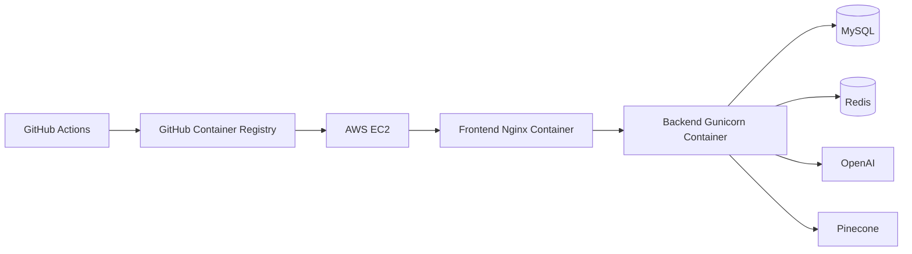

# CAREER.zip Backend

<div align="center">

## Django REST Framework 기반 AI 모의면접 API 서버

회원·지원 자료 관리부터 자료 분석, 질문 생성, 면접 진행, 답변 평가, 꼬리질문,  
최종 리포트와 관리자 기능까지 CAREER.zip의 Backend 및 AI 기능을 담당합니다.

</div>

---

## 📚 목차

- [1. Backend 개요](#1-backend-개요)
- [2. 기술 스택](#2-기술-스택)
- [3. 시스템 구성](#3-시스템-구성)
- [4. Django 앱 구조](#4-django-앱-구조)
- [5. 주요 API](#5-주요-api)
- [6. AI 면접 Pipeline](#6-ai-면접-pipeline)
- [7. 데이터 모델](#7-데이터-모델)
- [8. 환경변수](#8-환경변수)
- [9. 로컬 실행](#9-로컬-실행)
- [10. Management Commands](#10-management-commands)
- [11. 테스트](#11-테스트)
- [12. Docker 및 배포](#12-docker-및-배포)
- [13. 구현 범위](#13-구현-범위)

---

# 1. Backend 개요

CAREER.zip Backend는 Django REST Framework 기반 API 서버입니다.

## 담당 범위

- 회원가입, 로그인, JWT, OAuth, 이메일 인증
- 이력서, 자기소개서, 채용공고, 프로젝트 경험 관리
- 지원 자료 분석과 예상 질문 생성
- 면접 세션, 질문, 답변, STT·TTS 처리
- 답변 충분성 판단과 약점 태그 추출
- 약점 기반 꼬리질문 생성
- 전문성·논리성·구체성·전달력 평가
- 최종 리포트, PDF, 로드맵, 추천 질문 생성
- 프롬프트·페르소나 버전 관리
- 포인트, 감사 로그, 가드레일 등 관리자 기능
- Worknet 등 외부 채용정보 API 연동

## 기본 API Prefix

```text
/api/v1/
```

---

# 2. 기술 스택

| 영역 | 기술 |
|---|---|
| Language | Python 3.12 |
| Framework | Django 4.2, Django REST Framework 3.15 |
| Authentication | SimpleJWT 5.4.0, Refresh Cookie, Google·Kakao OAuth |
| Database | MySQL, SQLite Local Fallback |
| Cache | Redis, django-redis, LocMem Local Fallback |
| AI | OpenAI SDK 1.59.2, LangSmith |
| Retrieval | Pinecone, MySQL Keyword Fallback |
| NLP | sentence-transformers, SBERT |
| Document | PyMuPDF, python-docx |
| Report | ReportLab |
| Storage | django-storages, boto3, AWS S3 (선택) |
| Test | pytest, Django Test |
| Deploy | Docker, Gunicorn, GitHub Actions, AWS EC2 |

## 데이터 저장소 역할

| 저장소 | 역할 |
|---|---|
| MySQL | 사용자, 지원 자료, 분석, 면접, 평가, 리포트 등 서비스 데이터 |
| Redis | OAuth 일회용 교환 코드와 다중 Worker 간 공유 캐시 |
| Pinecone | 질문 은행 Vector Search |
| SQLite | `DATABASE_URL`이 없는 로컬 개발 환경의 기본 DB |
| LocMem Cache | Redis가 없는 로컬·테스트 환경의 캐시 대체 |

Pinecone이 설정되지 않았거나 검색에 실패하면 MySQL Keyword Search로 대체합니다.

---

# 3. 시스템 구성



> AWS S3, Worknet, OCR은 관련 환경변수와 기능을 활성화한 경우에만 사용하는 선택 연동입니다. Google·Kakao OAuth는 `accounts` 인증 흐름에서 처리합니다.

## Backend 요청 흐름

```text
Client Request
    ↓
URL Routing
    ↓
Authentication / Permission
    ↓
View / Serializer
    ↓
Service Layer
    ↓
DB · Cache · OpenAI · External API
    ↓
Structured Response
```

---

# 4. Django 앱 구조

```text
CAREER_DOT_ZIP_BACKEND/
├── apps/
│   ├── accounts/
│   ├── input/
│   ├── analysis/
│   ├── interview/
│   ├── evaluation/
│   ├── report/
│   ├── prompt/
│   ├── admin_api/
│   ├── question_bank/
│   ├── document/
│   ├── external/
│   ├── mypage/
│   └── common/
├── config/
├── docs/
├── manage.py
├── pytest.ini
├── requirements.txt
├── requirements.prod.txt
├── Dockerfile.prod
├── entrypoint.sh
└── gunicorn.conf.py
```

## 모듈별 역할

| 앱 | 역할 |
|---|---|
| `accounts` | 사용자, 이메일 인증, JWT, OAuth, 약관, 포인트 |
| `input` | JD, 이력서, 자기소개서, 프로젝트, 인재상 입력 |
| `analysis` | 지원 자료 분석, JD 매칭, 예상 질문 생성 |
| `interview` | 면접 세션, 질문, 답변, 꼬리질문, STT·TTS |
| `evaluation` | 답변 평가, BEI·CBI·SBERT·음성 지표, 강점·약점 태그 |
| `report` | 최종 리포트, PDF, 로드맵, 액션 플랜, 추천 질문 |
| `prompt` | 면접관 페르소나, 프롬프트 템플릿, 버전 관리 |
| `admin_api` | 관리자 대시보드, 회원, 포인트, 가드레일, 감사 로그 |
| `question_bank` | 질문 은행, AI Hub Import, Pinecone Embedding |
| `document` | 업로드 문서 관리와 파싱 |
| `external` | Worknet, Mock Job 등 외부 채용정보 연동 |
| `mypage` | 면접 이력과 성장 지표 |
| `common` | Choices, Permission 등 공통 유틸리티 |

---

# 5. 주요 API

아래 표는 전체 API 중 서비스 흐름을 이해하기 위한 대표 경로입니다.  
세부 요청·응답 형식은 각 앱의 `urls.py`, View, Serializer를 확인해 주세요.

## Health Check

| Method | Endpoint | 설명 |
|---|---|---|
| GET | `/api/v1/health` | 기본 상태 확인 |
| GET | `/api/v1/health/live` | Liveness Check |
| GET | `/api/v1/health/ready` | DB·Cache Readiness Check |

## Authentication

| Method | Endpoint | 설명 |
|---|---|---|
| POST | `/api/v1/auth/signup` | 회원가입 |
| POST | `/api/v1/auth/login` | 로그인 및 JWT 발급 |
| POST | `/api/v1/auth/logout` | 로그아웃 |
| POST | `/api/v1/auth/token/refresh` | Access Token 갱신 |
| GET | `/api/v1/auth/me` | 현재 사용자 조회 |
| GET | `/api/v1/auth/oauth/<provider>/start` | OAuth 시작 |
| GET·POST | `/api/v1/auth/oauth/<provider>/callback` | OAuth Callback |
| POST | `/api/v1/auth/oauth/exchange` | OAuth 일회용 코드 교환 |

> 인증 API 일부는 trailing slash가 있는 경로도 함께 지원합니다.

## 지원 자료

| Method | Endpoint | 설명 |
|---|---|---|
| GET·POST | `/api/v1/jds` | 채용공고 조회·등록 |
| GET·POST | `/api/v1/resumes` | 이력서 조회·등록 |
| GET·POST | `/api/v1/cover-letters` | 자기소개서 조회·등록 |
| GET·POST | `/api/v1/projects` | 프로젝트 경험 조회·등록 |

각 Resource는 상세 조회, 수정, 삭제 API를 제공합니다.

## 분석 및 예상 질문

| Method | Endpoint | 설명 |
|---|---|---|
| POST | `/api/v1/analysis/analyze/` | 선택한 지원 자료 분석 시작 |
| POST | `/api/v1/analysis/status/` | 분석 상태 조회 |
| POST | `/api/v1/analysis/match/` | JD와 지원 자료 매칭 결과 조회 |
| GET·POST | `/api/v1/analysis/questions/` | 예상 질문 조회·생성 |

## 현재 Frontend 기본 면접 Flow

현재 Frontend는 아래 MVP Surface를 기본 면접 흐름으로 사용합니다.

| Method | Endpoint | 설명 |
|---|---|---|
| POST | `/api/v1/sessions` | 면접 세션 생성 |
| GET | `/api/v1/sessions/<session_id>` | 세션 상세 조회 |
| PATCH | `/api/v1/sessions/<session_id>/status` | 세션 상태 변경 |
| POST | `/api/v1/sessions/<session_id>/questions/generate` | 질문 생성 |
| GET | `/api/v1/sessions/<session_id>/questions` | 세션 질문 조회 |
| POST | `/api/v1/answers` | 답변 저장 |
| PATCH | `/api/v1/answers/<answer_id>/stt` | STT 결과 반영 |
| POST | `/api/v1/answers/<answer_id>/followup` | 충분성 판단 및 꼬리질문 요청 |
| POST | `/api/v1/stt/transcribe` | 음성 답변 STT 변환 |
| POST | `/api/v1/tts/speech` | 질문 TTS 생성 |
| GET | `/api/v1/sessions/<session_id>/report` | 세션 리포트 조회 |
| GET | `/api/v1/sessions/<session_id>/roadmap` | 성장 로드맵 조회 |

## Full Interview Surface

`/api/v1/interviews/...`는 세션 상세 제어, Question Pack, Full/Admin 성격의 별도 Surface입니다.

| Method | Endpoint | 설명 |
|---|---|---|
| GET·POST | `/api/v1/interviews/sessions` | 면접 세션 조회·생성 |
| GET | `/api/v1/interviews/sessions/<session_id>` | 세션 상세 조회 |
| PATCH | `/api/v1/interviews/sessions/<session_id>/status` | 세션 상태 변경 |
| PATCH | `/api/v1/interviews/sessions/<session_id>/complete` | 세션 완료 처리 |
| POST | `/api/v1/interviews/sessions/<session_id>/questions/generate` | 면접 질문 생성 |
| GET | `/api/v1/interviews/sessions/<session_id>/questions` | 면접 질문 조회 |
| POST | `/api/v1/interviews/sessions/<session_id>/questions/<question_id>/answer` | 질문 답변 저장 |

## 평가 및 리포트

| Method | Endpoint | 설명 |
|---|---|---|
| POST | `/api/v1/evaluations` | 답변 평가 생성 |
| GET | `/api/v1/evaluations/<uuid:answer_id>` | 답변별 평가 조회 |
| POST | `/api/v1/reports/sessions/<uuid:session_id>/generate` | 최종 리포트 생성 |
| GET | `/api/v1/reports/sessions/<uuid:session_id>/pdf` | 리포트 PDF 생성·다운로드 |

평가는 명시적인 평가 API 호출 또는 리포트 생성 시 누락 평가를 보완하는 Backfill 경로에서 수행됩니다.

## 관리자

| Method | Endpoint | 설명 |
|---|---|---|
| GET | `/api/v1/admin/dashboard` | 운영 대시보드 |
| GET | `/api/v1/admin/members` | 회원 목록 조회 |
| PATCH | `/api/v1/admin/members/<member_id>/status` | 회원 상태 변경 |
| GET | `/api/v1/admin/points/policies` | 포인트 정책 조회 |
| PATCH | `/api/v1/admin/points/policies/<policy_id>` | 포인트 정책 수정 |
| GET | `/api/v1/admin/guardrails/events` | 가드레일 이벤트 조회 |

---

# 6. AI 면접 Pipeline

## 현재 Frontend 기준 처리 흐름



> 답변 저장 직후 평가가 항상 자동 실행되는 구조는 아닙니다. 평가는 `/api/v1/evaluations` 호출 또는 리포트 생성 시 누락 평가 Backfill을 통해 실행됩니다.

## 단계별 구성

| 단계 | 주요 입력 | 처리 | 저장·출력 |
|---|---|---|---|
| 지원 자료 분석 | JD, 이력서, 자기소개서, 프로젝트·GitHub | 키워드, 경험, STAR, 매칭 정보 추출 | `AnalysisSession`, `JdAnalysis` |
| 예상 질문 생성 | JD Keyword, Resume Analysis | Pinecone RAG 또는 MySQL Keyword Search 후 LLM 생성 | `GeneratedQuestion` |
| 질문별 문서 선택 | 세션 자료, 예상 질문 | 현재 질문에 필요한 자료만 Context로 구성 | `QuestionSourceTag` |
| 메인 질문 생성 | Context, 면접 유형, 페르소나 | AI → Prepared Question → Question Bank → Rule Fallback | `InterviewQuestion` |
| 답변 저장 | Text, STT Text, Audio Metrics | 가드레일 검사 후 저장 | `InterviewAnswer`, `GuardrailEvent` |
| 충분성 판단 | 질문, 답변, Context | 질문 의도 충족 여부와 다음 행동 결정 | `next_action`, 선택된 약점 |
| 약점 태그 | 평가와 충분성 결과 | 답변 부족 요소 구조화 | `WeaknessTag`, `AnswerWeaknessTag` |
| 꼬리질문 | 현재 질문·답변, 약점 | 보완 질문 생성 및 근거 검증 | Follow-up `InterviewQuestion` |
| 답변 평가 | 질문, 답변, Pause·Filler | LLM, SBERT, 로컬 음성 지표 결합 | `Evaluation` |
| 최종 리포트 | 세션 답변, 평가, 태그 | 누락 평가 Backfill 후 결과 종합 | `FinalReport`, `ActionPlan` |

## 질문 생성 Fallback

```text
AI Question Generation
        ↓ 실패 또는 사용 불가
Prepared Questions
        ↓ 없음
Question Bank
        ↓ 없음
Rule-based Fallback
```

## 질문 RAG Fallback

```text
Pinecone Vector Search
        ↓ 미설정 또는 실패
MySQL Keyword Search
        ↓
Question Context
```

## 답변 충분성 판단

답변 평가와 꼬리질문 생성을 분리하기 위해, 현재 답변이 질문 의도에 충분히 대응했는지를 먼저 판정합니다.

주요 판단 요소:

- 질문 핵심에 답했는가
- 설명이 지나치게 추상적이지 않은가
- 상황, 역할, 행동, 결과가 구체적인가
- 기술 선택 이유와 근거가 있는가
- 지원자 본인의 기여가 명확한가

```text
NEXT        → 다음 메인 질문
FOLLOW_UP   → 약점 기반 꼬리질문
GUARDRAIL   → 무응답·사담·부적절 입력 처리
```

## 평가 기준

| 축 | 내용 |
|---|---|
| 전문성 | 기술 개념 정확성, 기술 선택 근거, 직무 이해 |
| 논리성 | 답변 구조, 인과관계, 질문 의도와의 일치 |
| 구체성 | 상황·역할·행동·결과, 수치와 사례 |
| 전달력 | 발화 흐름, Pause, Filler, 반복 표현 |

평가 과정에서 다음 정보를 함께 참고합니다.

- BEI 기반 행동 경험 구조
- CBI 기반 직무 역량
- 사용자 자료와 답변 간 근거 일치
- SBERT 기반 의미 유사도
- 음성 답변의 Duration, Pause, Filler

## 면접관 페르소나

| Persona | 질문 방향 |
|---|---|
| `coach` | 긴장을 완화하고 답변을 자연스럽게 유도 |
| `practical` | 구현 과정, 기여도, 기술 선택 근거 확인 |
| `verifier` | 답변의 구체성, 일관성, 실제 경험 여부 검증 |

면접 세션의 Persona 값은 문자열로 저장되며, `PersonaConfig`와 직접 FK로 연결되지는 않습니다.

## Prompt 관리

AI Prompt는 DB에서 템플릿과 버전 단위로 관리합니다.

- `PersonaConfig`
- `PromptTemplate`
- `PromptVersion`
- `PersonaConfig`와 `PromptTemplate` 연결
- 활성 버전 지정
- 관리자 화면 수정
- 변경 이력 관리

초기 Prompt와 Persona는 Management Command로 Seed할 수 있습니다.

## OpenAI와 Mock 분리

면접 AI Chain은 설정에 따라 OpenAI Engine 또는 Mock Engine을 사용합니다.

```env
OPENAI_USE_MOCK=False
INTERVIEW_AI_CHAIN_ENGINE=openai
INTERVIEW_AI_OPENAI_ENABLE_REAL_CALL=True
```

실제 OpenAI 호출은 API Key와 실호출 활성화 설정이 모두 필요합니다.

## AI 가드레일

- 프롬프트 인젝션 탐지
- 내부 지침·시스템 정보 유출 방지
- 면접과 무관한 사담 처리
- 무응답 또는 부적절 답변 처리
- 사용자 자료에 없는 사실 단정 방지
- 꼬리질문 근거 검증
- 가드레일 이벤트 저장 및 관리자 조회

## STT·TTS

- OpenAI `whisper-1` 기반 음성 답변 변환
- `audio/webm`, `audio/webm;codecs=opus` 중심 입력 처리
- 기본 `gpt-4o-mini-tts` 모델을 사용한 질문 음성 생성
- `OPENAI_TTS_MODEL`로 TTS 모델 변경 가능
- TTS 응답 포맷은 MP3
- STT·TTS 사용 시 `OPENAI_API_KEY` 필요

---

# 7. 데이터 모델

## 핵심 관계



> `AnalysisSession`과 `InterviewSession` 사이에는 직접 FK가 없습니다. 또한 `InterviewSession.persona`는 문자열 값이며 `PersonaConfig`와 직접 FK로 연결되지 않습니다.

## 주요 모델

| 영역 | 모델 |
|---|---|
| 사용자 | `User`, OAuth·약관·Point 관련 모델 |
| 입력 | `JobDescription`, `ResumeMaster`, `CoverLetter`, `ProjectExperience` |
| 분석 | `AnalysisSession`, `JdAnalysis`, `GeneratedQuestion` |
| 면접 | `InterviewSession`, `InterviewQuestion`, `QuestionSourceTag`, `InterviewAnswer` |
| 평가 | `Evaluation`, `WeaknessTag`, `AnswerWeaknessTag`, `StrengthTag` |
| 리포트 | `FinalReport`, `ActionPlan` |
| AI 관리 | `PersonaConfig`, `PromptTemplate`, `PromptVersion` |
| 운영 | `PointHistory`, `AuditLog`, `GuardrailEvent` |

상세 필드와 제약조건은 각 앱의 `models.py`와 Migration을 기준으로 확인해 주세요.

---

# 8. 환경변수

`.env.example`을 복사해 로컬 환경에 맞게 설정합니다.

```bash
cp .env.example .env
```

Windows에서는 직접 `.env` 파일을 생성해도 됩니다. 아래는 대표 환경변수이며, 전체 목록과 기본값은 `.env.example`과 `config/settings.py`를 기준으로 확인합니다.

## Django 및 보안

| 변수 | 필수성 | 용도 |
|---|---|---|
| `SECRET_KEY` | 운영 필수 | Django Secret Key |
| `DEBUG` | 필수 | Debug Mode |
| `ALLOWED_HOSTS` | 운영 필수 | 허용 Host |
| `CORS_ALLOWED_ORIGINS` | 운영 Frontend 연동 시 | CORS Origin |
| `CSRF_TRUSTED_ORIGINS` | 운영 구성에 따라 | CSRF 신뢰 Origin |
| `REFRESH_COOKIE_SECURE` | 운영 권장 | Refresh Cookie Secure 설정 |
| `REFRESH_COOKIE_SAMESITE` | 선택 | Refresh Cookie SameSite |
| `REFRESH_COOKIE_PATH` | 선택 | Refresh Cookie Path |
| `REFRESH_COOKIE_DOMAIN` | 선택 | Refresh Cookie Domain |
| `SESSION_COOKIE_SECURE` | 운영 권장 | Session Cookie Secure 설정 |
| `CSRF_COOKIE_SECURE` | 운영 권장 | CSRF Cookie Secure 설정 |
| `SECURE_BEHIND_PROXY` | Reverse Proxy 사용 시 | Proxy HTTPS 인식 |
| `SECURE_SSL_REDIRECT` | 운영 권장 | HTTPS Redirect |
| `SECURE_HSTS_SECONDS` | 운영 선택 | HSTS 유지 시간 |
| `SECURE_HSTS_INCLUDE_SUBDOMAINS` | 운영 선택 | HSTS Subdomain 적용 |
| `SECURE_HSTS_PRELOAD` | 운영 선택 | HSTS Preload |

## Database 및 Cache

| 변수 | 필수성 | 용도 |
|---|---|---|
| `DATABASE_URL` | 운영 필수 | MySQL 등 DB 연결 |
| `REDIS_URL` | 운영 OAuth·다중 Worker 환경 | 공유 Cache |
| `REDIS_KEY_PREFIX` | 선택 | Redis Key Namespace |

`DATABASE_URL`이 없으면 SQLite를 사용하고, 개발 환경에서 Redis가 없으면 LocMem Cache로 대체할 수 있습니다.

## OpenAI 및 면접 AI

| 변수 | 필수성 | 용도 |
|---|---|---|
| `OPENAI_API_KEY` | AI 실호출 필수 | OpenAI 인증 |
| `OPENAI_USE_MOCK` | 선택 | OpenAI Mock 사용 여부 |
| `INTERVIEW_AI_CHAIN_ENGINE` | 선택 | `openai` 또는 `mock` |
| `INTERVIEW_AI_OPENAI_MODEL` | 선택 | 면접 AI 기본 모델 |
| `INTERVIEW_AI_OPENAI_TIMEOUT_SECONDS` | 선택 | OpenAI Timeout |
| `INTERVIEW_AI_OPENAI_MAX_RETRIES` | 선택 | OpenAI Retry 횟수 |
| `INTERVIEW_AI_OPENAI_ENABLE_REAL_CALL` | 실호출 필수 | OpenAI 실호출 활성화 |
| `OPENAI_MODEL_QUESTION_GENERATION` | 선택 | 질문 생성 모델 |
| `OPENAI_MODEL_ANSWER_SUFFICIENCY` | 선택 | 충분성 판단 모델 |
| `OPENAI_MODEL_FOLLOWUP_GENERATION` | 선택 | 꼬리질문 모델 |
| `OPENAI_TTS_MODEL` | 선택 | TTS 모델 Override |

## Pinecone, 검색 및 LangSmith

| 변수 | 필수성 | 용도 |
|---|---|---|
| `PINECONE_API_KEY` | RAG 사용 시 | Pinecone 인증 |
| `PINECONE_INDEX_NAME` | RAG 사용 시 | 질문 Index |
| `SBERT_ENABLED` | 선택 | SBERT 평가 활성화 |
| `GITHUB_TOKEN` | GitHub 분석 시 권장 | GitHub API 인증과 Rate Limit 완화 |
| `TAVILY_API_KEY` | Tavily 검색 사용 시 | 검색 API 인증 |
| `LANGCHAIN_TRACING_V2` | 선택 | LangSmith Tracing 활성화 |
| `LANGCHAIN_API_KEY` | Tracing 사용 시 | LangSmith 인증 |
| `LANGCHAIN_PROJECT` | 선택 | Trace Project |
| `LANGSMITH_ENDPOINT` | 선택 | LangSmith Endpoint |

> 환경변수 이름은 LangChain 형식을 사용하지만, 프로젝트 의존성에서 LangChain 패키지 사용은 확인되지 않았습니다. 문서에서는 LangSmith Tracing으로 표기합니다.

## OAuth

| 변수 | 필수성 | 용도 |
|---|---|---|
| `GOOGLE_OAUTH_CLIENT_ID` | Google OAuth 사용 시 | Google Client ID |
| `GOOGLE_OAUTH_CLIENT_SECRET` | Google OAuth 사용 시 | Google Client Secret |
| `GOOGLE_OAUTH_REDIRECT_URI` | Google OAuth 사용 시 | Google Callback URI |
| `KAKAO_OAUTH_CLIENT_ID` | Kakao OAuth 사용 시 | Kakao Client ID |
| `KAKAO_OAUTH_CLIENT_SECRET` | Kakao OAuth 사용 시 | Kakao Client Secret |
| `KAKAO_OAUTH_REDIRECT_URI` | Kakao OAuth 사용 시 | Kakao Callback URI |
| `FRONTEND_BASE_URL` | OAuth·메일 링크 사용 시 | Frontend Base URL |
| `FRONTEND_OAUTH_CALLBACK_PATH` | OAuth 사용 시 | Frontend Callback Path |
| `OAUTH_EXCHANGE_CODE_TTL_SECONDS` | 선택 | OAuth 교환 코드 TTL |

## Email

| 변수 | 필수성 | 용도 |
|---|---|---|
| `EMAIL_BACKEND` | 이메일 기능 사용 시 | Django Email Backend |
| `EMAIL_HOST` | SMTP 사용 시 | SMTP Host |
| `EMAIL_PORT` | SMTP 사용 시 | SMTP Port |
| `EMAIL_HOST_USER` | SMTP 사용 시 | SMTP 계정 |
| `EMAIL_HOST_PASSWORD` | SMTP 사용 시 | SMTP 비밀번호 |
| `EMAIL_USE_TLS` | 선택 | TLS 사용 |
| `EMAIL_USE_SSL` | 선택 | SSL 사용 |
| `EMAIL_TIMEOUT` | 선택 | Email Timeout |
| `DEFAULT_FROM_EMAIL` | 이메일 기능 사용 시 | 기본 발신 주소 |
| `ADMIN_NOTIFICATION_EMAIL` | 선택 | 관리자 알림 수신 |
| `EMAIL_VERIFICATION_TOKEN_MAX_AGE` | 선택 | 이메일 인증 토큰 만료 |
| `PASSWORD_RESET_TIMEOUT` | 선택 | 비밀번호 재설정 만료 |
| `PASSWORD_RESET_REQUEST_COOLDOWN_SECONDS` | 선택 | 비밀번호 재설정 요청 제한 |
| `EMAIL_CODE_TTL_SECONDS` | 선택 | 인증 코드 TTL |
| `EMAIL_CODE_MAX_ATTEMPTS` | 선택 | 인증 코드 최대 시도 |
| `EMAIL_CODE_RESEND_COOLDOWN_SECONDS` | 선택 | 인증 코드 재전송 제한 |

## 외부 서비스

| 변수 | 필수성 | 용도 |
|---|---|---|
| `AWS_S3_BUCKET_NAME` | S3 사용 시 | Media Bucket |
| `AWS_S3_REGION_NAME` | S3 사용 시 | Region |
| `AWS_ACCESS_KEY_ID` | S3 사용 시 | AWS 인증 |
| `AWS_SECRET_ACCESS_KEY` | S3 사용 시 | AWS 인증 |
| `WORKNET_API_KEY` | Worknet 사용 시 | 채용정보 API |
| `WORKNET_BASE_URL` | 선택 | Worknet Endpoint |
| `JOBS_PROVIDER` | 선택 | Worknet 또는 Mock |
| `MOCK_JOBS_COUNT` | Mock Job 사용 시 | 생성·로딩 건수 |
| `MOCK_JOBS_SEED` | Mock Job 사용 시 | 난수 Seed |
| `MOCK_JOBS_DATA_FILE` | Mock Job 사용 시 | 데이터 파일 경로 |
| `OCR_PROVIDER` | OCR 사용 시 | OCR Provider |
| `OCR_API_KEY` | OCR 사용 시 | OCR 인증 |

민감 값이 포함된 `.env` 파일은 Git에 Commit하지 않습니다.

---

# 9. 로컬 실행

## 요구사항

- Python 3.12 권장
- Git
- MySQL 선택
- Redis 선택
- OpenAI·Pinecone 등은 사용하는 기능에 따라 선택

## 1. Clone

메인 저장소의 Submodule로 내려받은 경우:

```bash
git submodule update --init --recursive
cd CAREER_DOT_ZIP_BACKEND
```

Backend 저장소만 Clone한 경우:

```bash
git clone <BACKEND_REPOSITORY_URL>
cd CAREER_DOT_ZIP_BACKEND
```

## 2. 가상환경 생성

### Windows

```bash
python -m venv .venv
.venv\Scripts\activate
```

### macOS / Linux

```bash
python3 -m venv .venv
source .venv/bin/activate
```

## 3. 패키지 설치

```bash
pip install --upgrade pip
pip install -r requirements.txt
```

## 4. 환경변수 설정

```bash
cp .env.example .env
```

로컬에서 SQLite와 Mock AI를 사용하면 MySQL, Redis, OpenAI 없이도 일부 기능과 테스트를 실행할 수 있습니다.

예시:

```env
DEBUG=True
OPENAI_USE_MOCK=True
INTERVIEW_AI_CHAIN_ENGINE=mock
INTERVIEW_AI_OPENAI_ENABLE_REAL_CALL=False
```

## 5. Migration

```bash
python manage.py migrate
```

Migration 변경 사항 확인:

```bash
python manage.py makemigrations --check --dry-run
```

## 6. 선택: 초기 데이터 구성

기본 Prompt와 Persona 등록 권장:

```bash
python manage.py seed_interview_prompts --dedupe
```

MVP 샘플 데이터 등록 선택:

```bash
python manage.py seed_mvp_sample_dataset --apply
```

## 7. 개발 서버

```bash
python manage.py runserver
```

기본 주소:

```text
http://127.0.0.1:8000
```

API Prefix:

```text
http://127.0.0.1:8000/api/v1/
```

---

# 10. Management Commands

프로젝트에는 Seed, 질문 은행, 품질 평가, 운영 Batch를 위한 명령이 포함되어 있습니다.

| 명령 | 용도 |
|---|---|
| `seed_interview_prompts --dedupe` | 기본 프롬프트와 페르소나 등록 |
| `seed_mvp_sample_dataset --apply` | 로컬 MVP E2E 샘플 데이터 등록 |
| `seed_analysis_test_data --apply` | 자료 분석 테스트 데이터 등록 |
| `seed_mock_jobs --count 10000 --seed 2026 --dry-run` | Synthetic 채용공고 생성 |
| `import_aihub_questions --path <PATH> --dry-run` | AI Hub 질문 은행 Import |
| `embed_question_bank --batch-size 50 --dry-run` | 질문 은행 Pinecone Embedding |
| `test_interview_openai_chain --chain all --use-real` | 면접 AI Chain 수동 검증 |
| `run_quality_eval --model gpt-4o-mini` | 질문·답변 품질 LLM Judge |
| `run_dormancy_check --dry-run` | 휴면 계정 점검 |
| `run_withdrawal_cleanup --dry-run` | 탈퇴 계정 정리 점검 |

## Prompt Seed

```bash
python manage.py seed_interview_prompts --dedupe
```

## 분석 테스트 데이터

```bash
python manage.py seed_analysis_test_data --apply
```

## Mock Job 생성

먼저 Dry Run으로 확인합니다.

```bash
python manage.py seed_mock_jobs \
  --count 10000 \
  --seed 2026 \
  --dry-run
```

## 질문 은행 Import 및 Embedding

```bash
python manage.py import_aihub_questions \
  --path <AIHUB_DATA_PATH> \
  --dry-run
```

```bash
python manage.py embed_question_bank \
  --batch-size 50 \
  --dry-run
```

## 실제 OpenAI Chain 점검

```bash
python manage.py test_interview_openai_chain \
  --chain all \
  --use-real
```

실제 호출 전에 API Key와 실호출 활성화 설정을 확인해 주세요.

---

# 11. 테스트

## 전체 테스트

대표 명령:

```bash
pytest
```

Django Test Runner도 사용할 수 있습니다.

```bash
python manage.py test
```

## 특정 테스트

MVP 면접 E2E Flow:

```bash
pytest apps/interview/test_interview_mvp_e2e_flow.py
```

Accounts 앱:

```bash
python manage.py test apps.accounts -v1
```

## Marker

외부 연동 통합 테스트 제외:

```bash
pytest -m "not integration"
```

통합 테스트만 실행:

```bash
pytest -m integration
```

`integration` Marker에는 OpenAI뿐 아니라 GitHub 분석 등 외부 연동 테스트도 포함될 수 있습니다.

## 실제 OpenAI 통합 테스트

대부분의 단위 테스트는 Mock Engine, `OPENAI_USE_MOCK`, Patch를 이용해 외부 호출을 차단합니다.

실제 OpenAI 호출이 포함된 테스트에는 다음 설정이 필요합니다.

```env
RUN_OPENAI_INTEGRATION_TESTS=1
OPENAI_API_KEY=
OPENAI_USE_MOCK=False
INTERVIEW_AI_CHAIN_ENGINE=openai
INTERVIEW_AI_OPENAI_ENABLE_REAL_CALL=True
```

실행 대상은 실제 OpenAI 통합 테스트 파일 또는 Marker를 지정합니다.

```bash
pytest -m integration
```

실제 호출은 비용과 응답 변동성이 있으므로 별도 환경에서 실행하는 것을 권장합니다.

## 테스트 범위

- 회원가입, 인증, OAuth
- 지원 자료 CRUD와 문서 처리
- 분석 세션과 예상 질문
- 면접 세션 E2E Flow
- 질문 생성과 Fallback
- 충분성 판단과 꼬리질문
- 답변 평가와 약점 태그
- 최종 리포트
- 관리자 API
- Pinecone·MySQL Retrieval Fallback
- OpenAI Mock 및 실제 호출 분리

---

# 12. Docker 및 배포

## Production Image

Backend 운영 이미지는 다음 구성을 사용합니다.

- `python:3.12-slim`
- `requirements.prod.txt`
- CPU용 Torch
- Gunicorn
- Django Static 수집
- 선택적 Migration

## Container 시작 흐름

```text
Dockerfile.prod
    ↓
entrypoint.sh
    ├─ collectstatic
    ├─ RUN_MIGRATIONS=1이면 migrate
    └─ Gunicorn 실행
```

`gunicorn.conf.py`의 기본 Bind 주소는 `0.0.0.0:8000`이며, Backend Container는 내부 `8000` Port를 사용합니다.

## Backend 저장소 Compose

Backend 저장소의 `docker-compose.prod.yml`은 원격 이미지를 Pull하는 구성으로, `build:` 설정을 사용하지 않습니다.

```bash
docker compose -f docker-compose.prod.yml pull
docker compose -f docker-compose.prod.yml up -d
```

해당 Compose는 `DOCKERHUB_USERNAME/careerzip-backend` 형식의 이미지를 기대하므로 관련 환경변수와 Registry 인증이 필요합니다.

Migration Profile:

```bash
docker compose -f docker-compose.prod.yml \
  --profile migrate \
  run --rm migrate
```

종료:

```bash
docker compose -f docker-compose.prod.yml down
```

## Main 저장소 Compose

Frontend와 Backend를 함께 실행할 때는 Main 저장소 루트의 `docker-compose.prod.yml`을 사용합니다.

```bash
docker compose -f docker-compose.prod.yml pull
docker compose -f docker-compose.prod.yml \
  --profile migrate \
  run --rm migrate
docker compose -f docker-compose.prod.yml up -d
```

Main Compose는 `BACKEND_IMAGE`, `FRONTEND_IMAGE`를 통해 GHCR 이미지 경로를 설정할 수 있습니다.

## 배포 구조



## GitHub Actions

CI:

- Django Check
- Migration Dry Run
- Accounts Test
- Production Image Build
- Secret Scan

Deploy:

1. 수동 `workflow_dispatch`
2. GHCR Image Build·Push
3. EC2 SSH 접속
4. Docker Image Pull
5. `migrate` Profile 실행
6. Backend·Frontend 재기동
7. `/api/v1/health/ready` Health Check

---

# 13. 구현 범위

## OpenAI와 Mock

면접 AI Chain은 OpenAI Engine과 Mock Engine을 지원합니다. 실제 OpenAI 호출에는 API Key와 실호출 활성화 설정이 모두 필요합니다.

## Pinecone

Pinecone은 질문 RAG의 Primary Search로 사용하지만 필수 서비스는 아닙니다.

```text
Pinecone 실패 또는 미설정
    ↓
MySQL Keyword Fallback
```

## GitHub 분석

GitHub 저장소 URL을 바탕으로 다음 범위를 분석합니다.

- README
- Manifest와 Dependency 파일
- 주요 파일 일부

Commit, Pull Request, 코드 전체 품질, 실제 사용자 기여도를 직접 판정하는 기능은 아닙니다.

## 음성 분석

현재 범위:

- OpenAI `whisper-1` 기반 STT
- Duration
- Pause
- Filler

현재 포함하지 않는 범위:

- 표정
- 시선
- 자세
- 영상 기반 비언어 분석

## Persona

공식 선택값:

```text
coach
practical
verifier
```

---

<div align="center">

**CAREER.zip Backend**

지원자 자료 분석부터 AI 면접, 답변 평가, 최종 리포트까지  
서비스의 핵심 데이터와 AI 흐름을 연결합니다.

</div>